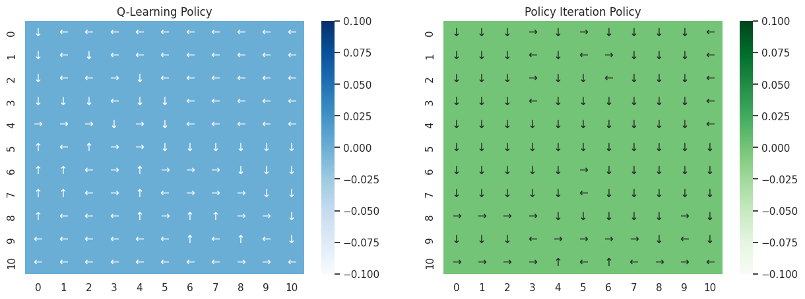
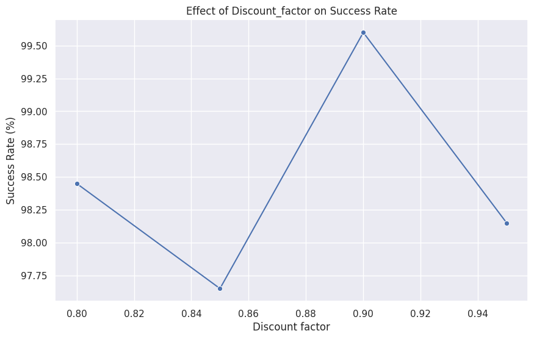
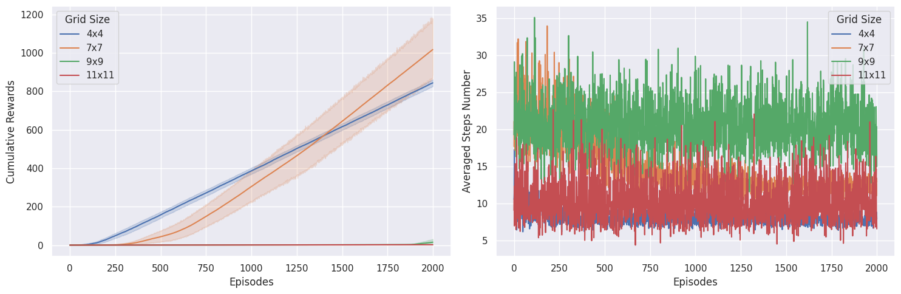

# Reinforcement Learning on FrozenLake using Q-Learning

This project implements a Q-Learning agent to solve the FrozenLake environment from Gymnasium. It studies how the environment size, exploration rate, and discount factor affect learning, and evaluates the final policy using Monte Carlo simulation.

## Objective

Train a reinforcement learning agent to navigate a slippery gridworld (FrozenLake) and reach the goal without falling into holes.

## Methods

- Tabular Q-Learning (model-free RL)
- ε-greedy action selection
- Monte Carlo evaluation (post-training)

Q-Learning update rule:

    Q(s, a) = Q(s, a) + α * [ r + γ * max_a' Q(s', a') − Q(s, a) ]

## Experiments

1. Map size comparison  
   - Trained on multiple FrozenLake map sizes: 4x4, 7x7, 9x9, 11x11  

2. Exploration rate (ε) tuning  
   - Tested values: 0.05, 0.10, 0.15, 0.20, 0.25, 0.30  

3. Discount factor (γ) tuning  
   - Tested values: 0.80, ~0.85, ~0.90, ~0.95  

4. Monte Carlo simulation  
   - 5,000 evaluation episodes using the learned policy  

## Key Results (FrozenLake)

- Best exploration rate (ε): around 0.10, with success rate close to 89%
- Best discount factor (γ): around 0.80–0.90, with success rate close to 95%
- Monte Carlo evaluation (5,000 episodes):
  - Average reward: 9.686
  - Median reward: 10.0
  - Minimum reward: 8.0
  - Maximum reward: 43.0

## Setup and Usage

1. Install dependencies:

    pip install gymnasium numpy matplotlib seaborn tqdm

2. Run the notebook locally:

    jupyter notebook ml5.ipynb

   or upload `ml5.ipynb` to Google Colab and run all cells.

## What This Project Shows

- How Q-Learning works in a discrete reinforcement learning environment
- How environment size affects learning difficulty and stability
- The impact of exploration rate (ε) and discount factor (γ) on performance
- How to evaluate a learned policy using Monte Carlo simulations instead of just a single test run

## Visual Results
## Visual Results

### Algorithm Comparison

### Hyperparameter Tuning

### Training Dynamics

## Possible Future Improvements

- Use a decaying ε schedule instead of a fixed exploration rate
- Experiment with different learning rates
- Extend from tabular Q-Learning to Deep Q-Learning (DQN) for more complex environments
